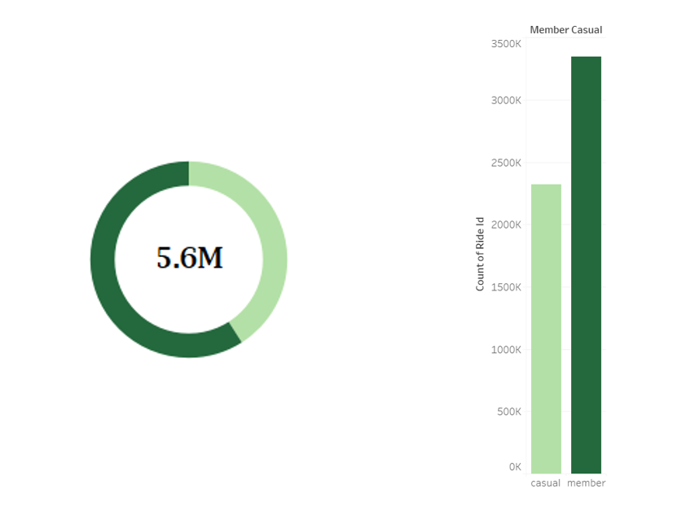
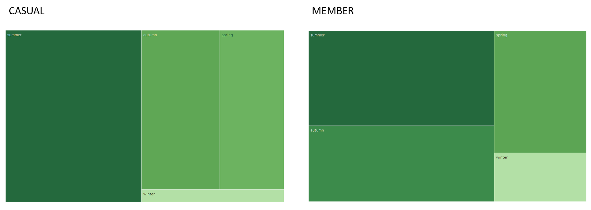
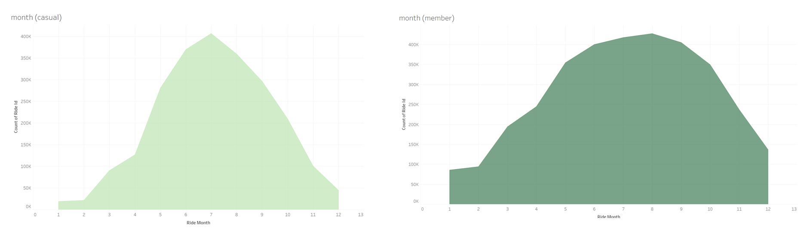
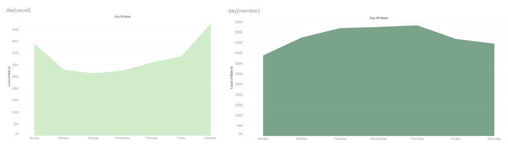

# About
This project is a part of **Google Data Analytics Certification Course Capstone Project**. This Repository contains file Python Notebook for my Analyze about this Case Study.
This project contains the results of my analysis regarding travel data from Cyclistic, a Fictional Bike-Sharing Company Based on Chicago from January-December 2022.

## Business Task

How do annual members and casual riders use Cyclistic bikes differently ?

> **Objective** : To clean, analyze and visualize the data to observe how casual riders use the bike rentals differently from annual member riders.

# Data Visualization & Analysis Results
Data visualization has been done using **Tableau Dashboard**
## Total User

## Total User by Season

## Total User by Month

## Total User by Day

## Summary & Recommendation
* Total **Member** user is bigger than **Casual** user
* **Casual** user rent a bike for holiday and tourism purpose, **Member** user rent bike for commuting regularly purpose
* Doing proper advertising at stations that are visited by many casual users may increase the change from casual users to members
* To increase profits, companies can increase prices for **Casual** users for unit rentals on weekends
* Providing many benefits and discounts on winter and weekdays can attract and increase user rental rates, especially for the **Casual user**
# Data Source
Google Data Analytics Certificated Course Program

For more Data Visualization, please refer to my [Tableau Account](https://public.tableau.com/app/profile/khotibul.umam8068/viz/Cyclistic_16901995932400/Member)

***Status : Completed Project***
